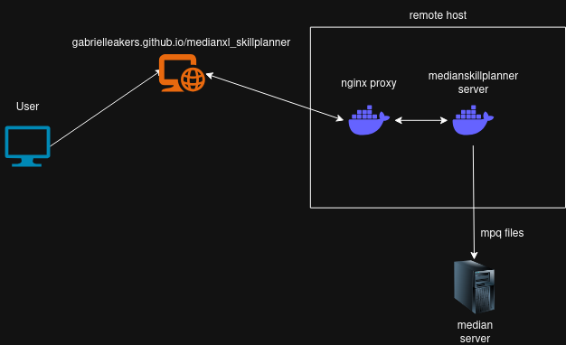

# medianxl_skillplanner
Skillplanner for median xl :)

The webpage is static but there is a server to parse the mpq files.

## Full deployment
See the steps in [./doc/setup-remote-docker.md](./doc/setup-remote-docker.md) to configure your server to enable remote docker contexts

Create `.env` file like this
```
PORT=<your port>
HOSTNAME=<your domain e.g. example.com>
SSH_DEPLOY_KEY=<path to your deploy PRIVATE key>
REMOTE_IP=<for deploying>
REMOTE_USER=<for deploying>
SSL_PATH=<path to folder containing cert and key>
SSL_CERT=<name of cert>
SSL_KEY=<name of key>
```

then
```
./deploy_remote.sh
```

I had some VERY strange errors related to a missing /run/user/1000/docker.sock file which i ended up fixing by doing this on the remote
```
sudo mkdir /run/user/1000
sudo ln -s /run/user/1004/docker.sock /run/user/1000/docker.sock
sudo chown -R $(whoami):$(whoami) /run/user/1000
```

I also had some cert reading problems since i run as non root which were solved by `sudo chmod +r privkey`

### Run the server alone
Run in Docker
```
./deploy_local.sh
```

You can also run it without docker for testing
```
npm run backend
```

### Run the client
```
npm run frontend
```

### Extra info
There's an nginx Dockerfile that I use on the backend as a reverse proxy for the actual app server

Architecture looks like this

